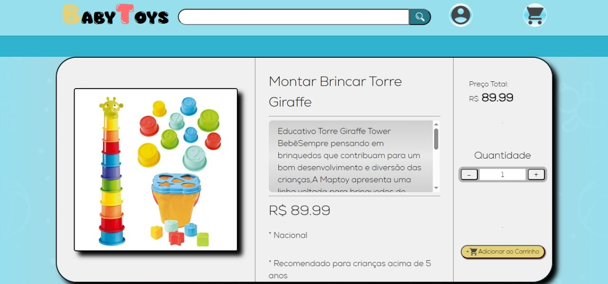

# Projeto de Conclusão de disciplina. *(12/2024)*

## 📦👶 Projeto BabyToys – Loja de vendas de artigos infantis
Uma loja de vendas de artigos infantis, que varia de brinquedos até itens de cuidado para seu filho, para categorias de bebês até pré-adolescentes.

# Funcionalidades do Sistema
## 👥 Área pública (visitantes)
- Nesse projeto, o usuário tem a possibilidade de criar a sua conta, ver informações dos produtos, adiciona-los em um carrinho de compras e efetuar esse pedido baseado no carrinho.
  
- Página inicial com destaque para promoções e eventos.

- Visualização dos produtos com imagens e descrições.

- Criação de contas para agendas, delivery, e retirada na cafeteria.

- Criação de avaliações para os produtos.

## 🔐 Área administrativa (restrita)
->Todas as opções de criação, visualização e exclusão de dados, somente podem ser executados se estiver logado a uma conta administradora 
*(Acesso à conta administradora do LocalStorage - Nome: Zoe Admin - Senha: 2018)*
- Login de administrador.

- CRUD completo para produtos do site (cadastrar, revisar, editar, remover).

- Gerenciamento de perfis.

- Possível de ver todos os dados cadastrados em tabelas, como produtos, contas cadastradas e pedidos efetuados, sendo possível de excluir separadamente cada informação.

## Tecnologias Utilizadas
- HTML– Criação da base do site.

- CSS – Para design do Front-End.

- Javascript – Para interações dinâmicas no Front-End.

- Javascript(LocalStorage) – Para simular um banco de dados e guardar as informações do site.

###  Utilização de GitHub para versionamento de versões.
